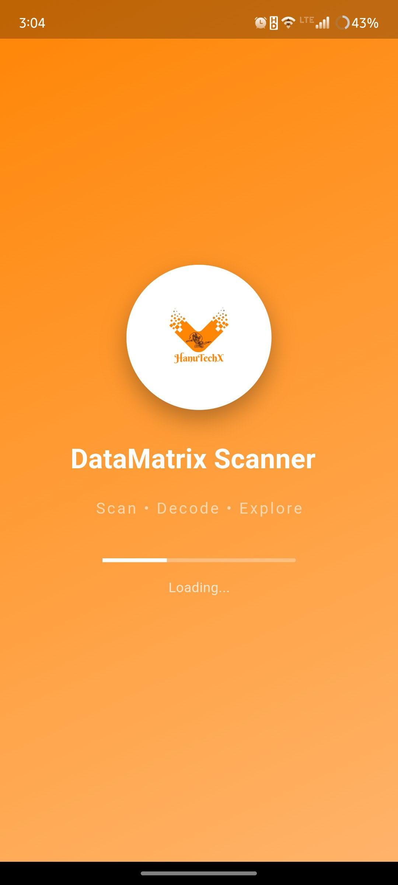
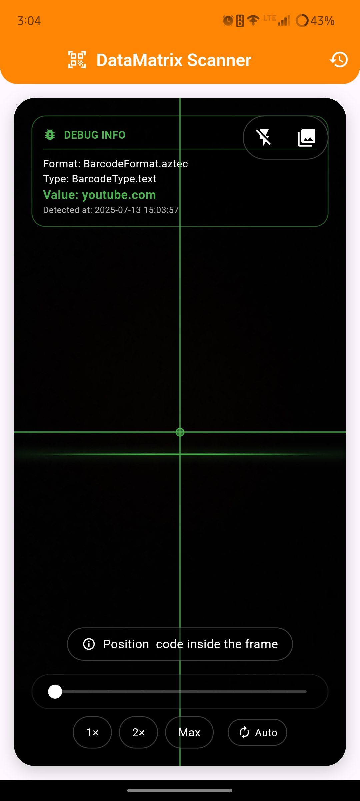
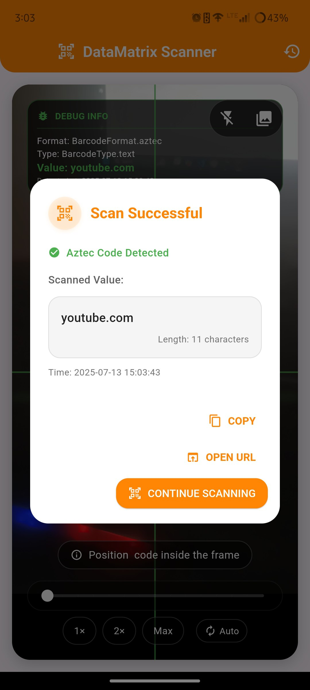

# 📱 HTX DataMatrix Scanner

<div align="center">
  
  
  [](https://flutter.dev)
  [](https://dart.dev)
  [](https://android.com)
  [](https://www.apple.com/ios)
  
  **A powerful and elegant DataMatrix & QR Code scanner built with Flutter**
  
  *Scan • Decode • Explore*
</div>

---

## ✨ Features

🔍 **Multi-Format Support**
- DataMatrix codes (Primary focus)
- QR Codes
- Aztec codes
- Code 128, 39, 93
- EAN-13, EAN-8
- PDF417 and more

📱 **Modern UI/UX**
- Beautiful splash screen with animations
- Intuitive camera interface
- Real-time scanning with visual feedback
- Crosshair targeting system

🎛️ **Advanced Controls**
- Pinch-to-zoom functionality
- Manual zoom presets (1x, 2x, Max)
- Auto-zoom toggle
- Flash/torch control
- Gallery image scanning

📊 **Smart Features**
- Scan history with timestamps
- URL detection and launching
- Copy to clipboard
- Haptic feedback
- Auto-focus optimization

🔒 **Privacy & Permissions**
- Secure camera permission handling
- No data collection
- Local storage only

---

## 📸 Screenshots

<div align="center">
  <table>
    <tr>
      <td align="center">
        
        <br><b>Splash Screen</b>
      </td>
      <td align="center">
        
        <br><b>Scanner Interface</b>
      </td>
    </tr>
    <tr>
      <td align="center">
        
        <br><b>Scan Result</b>
      </td>
      <td align="center">
        
        <br><b>Scan History</b>
      </td>
    </tr>
  </table>
</div>

---

## 🚀 Getting Started

### Prerequisites

Before you begin, ensure you have the following installed:

- **Flutter SDK** (3.0.0 or higher)
- **Dart SDK** (2.17.0 or higher)
- **Android Studio** or **VS Code** with Flutter extensions
- **Xcode** (for iOS development)

### 📋 Installation Steps

#### 1. Clone the Repository
```bash
git clone https://github.com/adarsht552/HTX-Data-Matrix-scanner.git
cd HTX-Data-Matrix-scanner
```

#### 2. Install Dependencies
```bash
flutter pub get
```

#### 3. Configure Permissions

**For Android** (`android/app/src/main/AndroidManifest.xml`):
```xml
<uses-permission android:name="android.permission.CAMERA" />
<uses-permission android:name="android.permission.INTERNET" />
```

**For iOS** (`ios/Runner/Info.plist`):
```xml
<key>NSCameraUsageDescription</key>
<string>This app needs camera access to scan DataMatrix codes and barcodes</string>
```

#### 4. Add Assets

Create the following directory structure:
```
assets/
  images/
    HanuTechX.png
  Screenshots/
    splash_screen.jpg
    QR_screen.jpg
    Result.jpg
    History.jpg
```

Update `pubspec.yaml`:
```yaml
flutter:
  assets:
    - assets/images/
    - assets/Screenshots/
```

#### 5. Run the Application

**For Android:**
```bash
flutter run
```

**For iOS:**
```bash
flutter run -d ios
```

**For specific device:**
```bash
flutter devices
flutter run -d [device-id]
```

---

## 🛠️ Development Setup

### Project Structure
```
lib/
├── main.dart                 # App entry point
├── splash_screen.dart        # Animated splash screen
├── homepage.dart            # Main scanner interface
├── history_page.dart        # Scan history page
├── scan_history_service.dart # History management
└── appconstant.dart         # App constants and themes
```

### Key Dependencies
```yaml
dependencies:
  flutter:
    sdk: flutter
  camera: ^0.10.5+5
  google_mlkit_barcode_scanning: ^0.7.0
  permission_handler: ^11.0.1
  url_launcher: ^6.2.1
  image_picker: ^1.0.4
  animated_text_kit: ^4.2.2
  flutter_staggered_animations: ^1.1.1
```

### Building for Release

**Android APK:**
```bash
flutter build apk --release
```

**Android App Bundle:**
```bash
flutter build appbundle --release
```

**iOS:**
```bash
flutter build ios --release
```

---

## 🎯 Usage Guide

### Basic Scanning
1. **Launch the app** - Enjoy the animated splash screen
2. **Grant camera permission** - Required for scanning functionality
3. **Point camera at code** - Align the DataMatrix/QR code within the crosshairs
4. **Automatic detection** - The app will automatically detect and process codes
5. **View results** - Scan results appear in a beautiful dialog

### Advanced Features

#### Zoom Controls
- **Pinch gesture**: Zoom in/out with two fingers
- **Preset buttons**: Quick zoom to 1x, 2x, or maximum
- **Auto-zoom toggle**: Enable automatic zoom adjustment

#### Gallery Scanning
- **Tap gallery icon** in the top-right corner
- **Select image** from your device
- **Automatic processing** of codes in the image

#### Scan History
- **Access history** via the history icon in the app bar
- **View all scans** with timestamps and formats
- **Copy or share** previous scan results

---

## 🔧 Troubleshooting

### Common Issues

**Camera not working:**
- Ensure camera permissions are granted
- Restart the app
- Check device camera functionality

**Scanning not detecting codes:**
- Ensure good lighting conditions
- Clean camera lens
- Try adjusting zoom level
- Use flash in low light

**App crashes on startup:**
- Update Flutter to latest version
- Run `flutter clean && flutter pub get`
- Check device compatibility

### Performance Tips
- Close other camera apps before using
- Ensure sufficient device storage
- Keep the app updated
- Restart device if experiencing issues

---

## 🤝 Contributing

We welcome contributions! Here's how you can help:

1. **Fork the repository**
2. **Create a feature branch** (`git checkout -b feature/AmazingFeature`)
3. **Commit your changes** (`git commit -m 'Add some AmazingFeature'`)
4. **Push to the branch** (`git push origin feature/AmazingFeature`)
5. **Open a Pull Request**

### Development Guidelines
- Follow Flutter/Dart style guidelines
- Add comments for complex logic
- Test on both Android and iOS
- Update documentation for new features

---

## 📄 License

This project is licensed under the MIT License - see the [LICENSE](LICENSE) file for details.

---

## 🙏 Acknowledgments

- **Flutter Team** for the amazing framework
- **Google ML Kit** for barcode scanning capabilities
- **Camera Plugin** contributors
- **Open Source Community** for inspiration and support

---

## 📞 Support & Contact

- **GitHub Issues**: [Report bugs or request features](https://github.com/adarsht552/HTX-Data-Matrix-scanner/issues)
- **Email**: [Adarshti786@gmail.com](mailto:Adarshti786@gmail.com)

---

## ⭐ Show Your Support

If you found this project helpful, please consider:

- ⭐ **Starring this repository**
- 🍴 **Forking for your own use**
- 📢 **Sharing with others**
- 🐛 **Reporting issues**
- 💡 **Suggesting improvements**

---

<div align="center">
  
## ☕ Buy Me a Coffee

If you like this project and want to support its development, consider buying me a coffee! Your support helps keep this project alive and motivates me to add more features.

[](https://www.buymeacoffee.com/adarsht552)

**Other ways to support:**
- ⭐ Star this repository
- 🐛 Report bugs and issues
- 💡 Suggest new features
- 📱 Share with friends and colleagues

*Every contribution, no matter how small, is greatly appreciated!* ❤️

---

**Made with ❤️ by [Adarsh T](https://github.com/adarsht552)**

*Happy Scanning! 📱✨*

</div>
